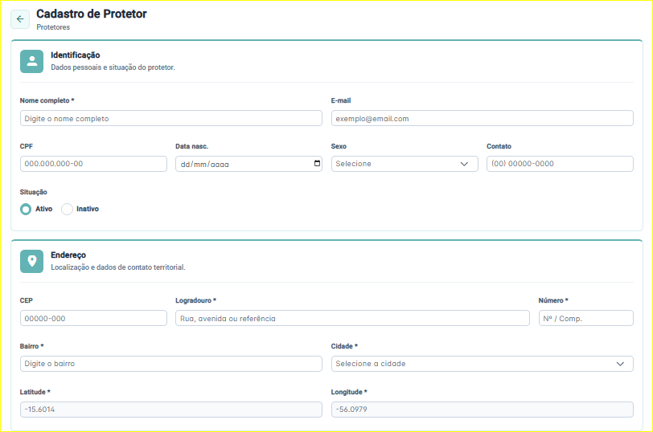
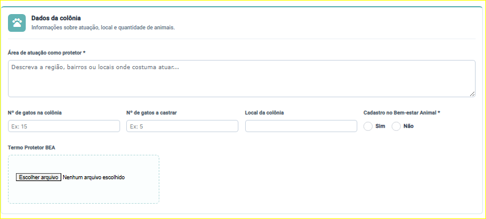
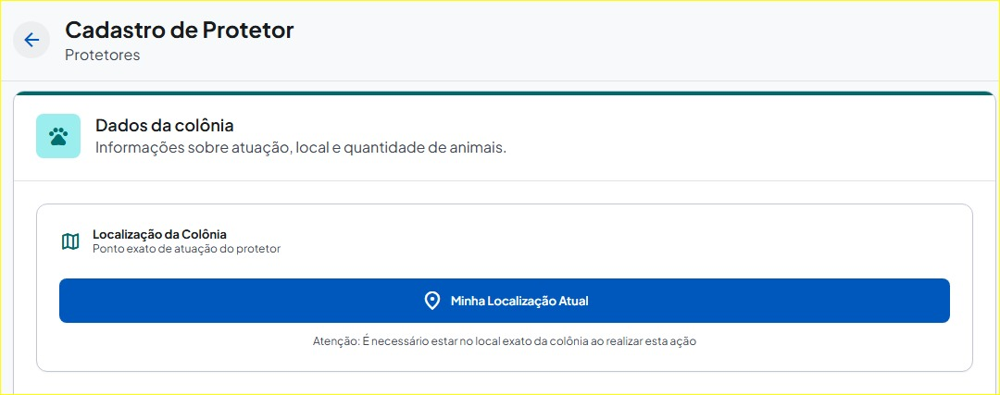
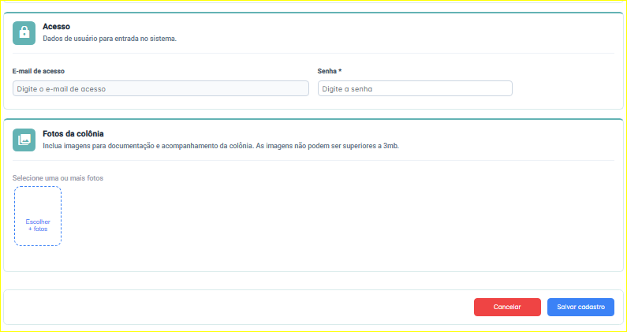

# 🐾 ONG Lunaar: Módulo de Cadastro de Protetores 🐾

E aí, meu 🐙! Esse repositório, como documentação, ilustra bem o resultado de como vem sendo meus etsudos com Angular, Stitch e Figma como Desenvolvedora Front-End! 

Este projeto foi desenvolvido com o objetivo de **mapear colônias de gatos de rua e estruturar o fluxo de cadastro de protetores da ONG Lunaar (Gestão Web - CodeMundi)**, sem o uso de APIs pagas como o Google Maps. Aqui, apliquei e consolidei conceitos importantes de arquitetura front-end e UX/UI para criar uma aplicação **responsiva, inteligente, escalável e com altíssima integridade de dados**.

---

## 🎥 Veja o Projeto em Ação!

Que tal dar uma olhada no design e no protótipo que deram origem ao código? 

* 🎨 **[Acessar a Tela Completa no Figma](https://www.figma.com/design/B2bF9Fmd66PofgwPCLhAmf/Tela-de-cadastro-de-Protetores?node-id=0-1&t=PKbdjgn0DsRnz6bQ-1)**
* 📱 **[Preview do Protótipo de Geolocalização (Stitch)](https://stitch.withgoogle.com/preview/16960950222773302853?node-id=a07437993e474edea1564e781f876c0d&raw)**

### Telas do Projeto:
<div align="center">
    
    
    <br>
    
    
</div>

---

## 💡 Funcionalidades Destaque

* **Geolocalização Nativa (Custo Zero):** Captura de coordenadas exatas da colônia usando a HTML5 Geolocation API do navegador, garantindo precisão sem depender de APIs pagas.
* **Lógica de "Carrinho" (1 protetor cuidando de inumeras colônias):** Permite que um único protetor adicione, valide e gerencie múltiplas colônias em uma lista antes do envio final.
* **Preenchimento Automático Inteligente:** Integração com a API do ViaCEP para preencher automaticamente Rua, Bairro e Cidade, poupando tempo da equipe.
* **Validações Estritas:** Uso avançado de Reactive Forms para travar envios incompletos e validar dados críticos (CPF, E-mail) em tempo real.
* **Design Responsivo & Acessível:** Otimizado para o uso em campo, do desktop ao mobile, utilizando componentes PrimeNG.

---

## 🛠 Tecnologias Utilizadas

* **Angular & TypeScript:** Estrutura base, roteamento, gerenciamento de estado síncrono e lógica de componentes.
* **Reactive Forms:** Abandono do *Template-Driven Forms* para garantir o controle absoluto do estado do formulário e validações complexas.
* **PrimeNG & PrimeFlex:** UI Kit para componentes avançados (`<p-dropdown>`, `<p-calendar>`) e classes utilitárias para eliminar `@media queries` excessivas no SCSS.
* **HTML5 Geolocation API & ViaCEP:** Integrações vitais para a captura de coordenadas físicas e automação de endereços.
* **Figma & Stitch:** Prototipação, mapeamento de estados e validação de regras de UX antes da codificação.
* **Swagger & VPNs (ZeroTier/AnyDesk):** Desenvolvimento *Mock-First* e configuração dinâmica de ambientes para integração remota com o Back-End.

---

## 🏗 Arquitetura e Clean Code
Para garantir que o sistema fosse escalável e fácil de manter, o primeiro passo foi traduzir o protótipo para o código, implementando o Design System da CodeMundi:

* **Componentização Inteligente:** Substituição de inputs nativos do HTML por componentes avançados do **PrimeNG**, garantindo uma interface profissional e responsiva.
* **Classes Utilitárias:** Adoção do PrimeFlex no HTML (`flex`, `gap-3`, `w-full`, `col-12 md:col-6`) para manter o código limpo, isolando nos estilos apenas as cores da marca e variáveis globais.
* **Integridade Contratual:** As validações estritas travam o botão de submissão (`[disabled]="form.invalid"`) até que o contrato de dados esteja perfeito para o Back-End Java/Spring Boot.

---

## 📍 A Funcionalidade Core: Geolocalização de Colônias

O maior desafio arquitetural e de negócios da tela foi o mapeamento exato das colônias sob responsabilidade do protetor.

**O Contexto e o Desafio:** O projeto exigia precisão na captura do local para evitar fraudes (ex: protetores cadastrando endereços de casa em vez do local real da colônia). No entanto, o uso da API do Google Maps foi descartado por questões de custo.

**A Solução Técnica:** Analisando o comportamento de aplicativos consolidados (como iFood e Uber), a solução encontrada foi utilizar a **HTML5 Geolocation API**. É um recurso nativo, gratuito e amplamente suportado, permitindo a captura das coordenadas via GPS de forma precisa.

**A Evolução da Regra de Negócio (Lógica de "Carrinho"):**
Como um protetor pode cuidar de **múltiplas colônias**, a UX foi adaptada para um modelo de array em memória:
1. O usuário captura a localização atual.
2. Confirma os dados processados pelo Back-End (Reverse Geocoding).
3. Adiciona a colônia a uma lista provisória (`<p-table>`), permitindo a exclusão antes do envio final em lote.

---

## 🎨 Entrega Visual: Prototipação no Figma e Stitch

Adoto a premissa de que a **lógica de código começa no design**. Utilizei o Stitch e o Figma em conjunto para desenhar a interface e prever os estados do componente:

* 🤳 **Estado Inicial (Ação):** Um botão grande com um aviso claro de que o protetor precisa estar *fisicamente* na colônia para clicar.
* 📲 **Estado de Processamento (Feedback):** Um estado de carregamento tranquiliza o usuário enquanto o sistema converte as coordenadas.
* 🔒 **Estado de Sucesso (Integridade):** Os campos aparecem preenchidos e travados (readonly com cadeado). A estética foi secundária em relação à segurança dos dados.

---

## 🚀 Conclusão e Impacto Gerado

A tela de Cadastro de Protetores deixou de ser um formulário estático para se tornar uma interface inteligente e guiada. O tempo de preenchimento foi reduzido, a integridade dos dados foi blindada, e o código final entregue está escalável e alinhado aos padrões do mercado.

O maior ganho deste projeto foi o exercício prático de empatia com o usuário final, compreendendo as restrições técnicas e formulando soluções viáveis antes de abrir o VSCode. 

> *"Às vezes, tudo o que precisamos é de alguém que nos desafie e acredite que podemos chegar lá. Fica o meu agradecimento ao Tech Lead Lucas, que ofereceu a mentoria exata, sem entregar a resposta pronta, para que eu pudesse superar esse desafio técnico."* — Miriã Amaral

---

## ⚙️ Como Rodar o Projeto (Localmente)

1. **Clone este repositório:**
```bash
   git clone [https://github.com/miriaamaral/documentacao-tela-cadastro-protetores.git](https://github.com/miriaamaral/documentacao-tela-cadastro-protetores.git)
```
2. Entre na pasta do projeto:
```Bash
   cd documentacao-tela-cadastro-protetores
```

3. Instale as dependências:
```Bash
   npm install
```

4. Execute o servidor de desenvolvimento:
```Bash
   ng serve
```

5. Acesse o projeto: Abra o seu navegador e acesse http://localhost:4200/.

✉️ Contato
Vamos nos conectar e construir algo incrível juntos!

Email: miriaamaralcs@gmail.com

LinkedIn: [https://www.linkedin.com/in/miriaamaralcs]
